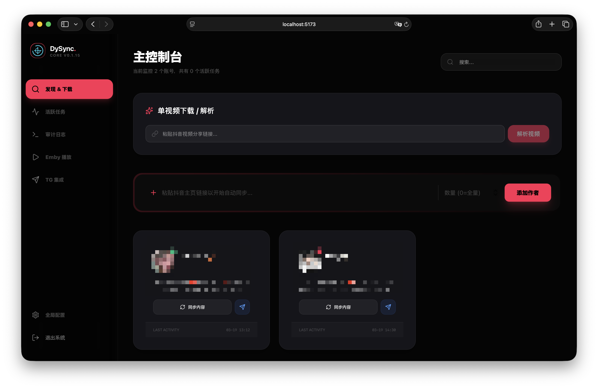
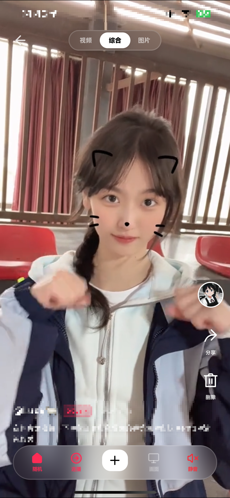

# DySyncEngine

**DySyncEngine** 用于抓取、保存和播放抖音、TikTok、快手及小红书内容。项目提供作者订阅、单作品下载、PWA 播放器、Emby 媒体库读取和 Telegram 推送功能。

<p align="center">
  
  
</p>

---

## 功能

### 内容抓取与下载
- 支持抖音、TikTok、快手和小红书的单个视频或图文作品解析下载。
- 抖音和 TikTok 支持全量抓取与增量同步。
- 快手支持视频作者订阅同步；小红书目前只支持单作品解析。
- 下载任务在后台执行，并在 WebUI 中显示进度和结果。

### 播放与媒体库
- 提供基于 PWA 的视频播放器，支持纵向切换作品。
- 支持从 Emby 读取媒体库内容，并结合本地数据库显示作者和作品信息。
- 支持视频播放和图文作品浏览。
- 支持长按倍速、横向拖动调节进度和播放模式切换。

### Telegram
- 新内容下载完成后，可以自动发送到指定的 Telegram 频道或对话。
- 图片发送前会根据需要转换格式，并支持分批发送。
- 可以手动同步已经下载的内容，补发历史文件。

### 任务与配置
- 可以查看抓取、下载和同步任务的状态与日志。
- 支持全局配置，也支持按作者覆盖视频下载、图文下载和 Telegram 推送设置。
- 可以配置同步间隔、平台 Cookie 和快捷指令令牌。
- 使用 JWT 进行 WebUI 登录认证。

---

## 技术栈

- **后端**: [FastAPI](https://fastapi.tiangolo.com/) (Python 3.11+) + [SQLAlchemy 2.0](https://www.sqlalchemy.org/) + [Telethon](https://github.com/LonamiWebs/Telethon)
- **前端**: [React 19](https://react.dev/) + [Vite 7](https://vitejs.dev/) + [Tailwind CSS 4](https://tailwindcss.com/) + [Framer Motion](https://www.framer.com/motion/)
- **数据库**: SQLite
- **部署**: [Docker](https://www.docker.com/) + Docker Compose

---

## 说明

本项目中的 **抖音和 TikTok 内容抓取** 功能基于开源项目 [Douyin_TikTok_Download_API](https://github.com/Evil0ctal/Douyin_TikTok_Download_API) 实现。
- 关于抓取引擎的具体配置、Cookie 维护及底层原理，请参考 [Douyin_TikTok_Download_API 项目说明](https://github.com/Evil0ctal/Douyin_TikTok_Download_API/blob/main/README.md)。
- **Cookie 配置**：容器首次启动会自动初始化 `./config` 下的抓取配置文件。登录 WebUI 后进入「全局配置」页面，直接粘贴并保存抖音/TikTok Cookie 即可，无需手动编辑或挂载 `config.yaml`。抖音 Cookie 可使用 [chrome-cookie-sniffer](https://github.com/Evil0ctal/Douyin_TikTok_Download_API/tree/main/chrome-cookie-sniffer) 获取。
- **快手支持范围**：当前支持快手单个作品链接解析与下载，包括视频作品和图文作品；快手作者订阅同步目前使用 PC Feed 接口，仅同步视频作品，暂不支持订阅同步中的图文作品。该接口存在较频繁的风控/限流，订阅同步可能需要稍后重试。
- **小红书支持范围**：当前支持 `xiaohongshu.com`、`xhslink.com` 与 `rednote.com` 单作品链接，视频返回 MP4，普通图文和实况图文返回 ZIP，也可保存到服务器。实况图会直接保存对应 MP4，静态图片仍按图片保存。作者订阅暂不支持；建议使用带有最新 `xsec_token` 的公开分享链接。Cookie 可选，可在 WebUI 配置以提高视频画质与解析成功率。作品页解析思路参考了 [XHS-Downloader](https://github.com/JoeanAmier/XHS-Downloader) 的公开实现，代码为独立实现。
- **抖音动态图**：图文作品中的动态图直接保留为 MP4 视频；如果作品同时包含静态图片，下载到本地或快捷指令下载时会和图片一起放入 ZIP，不封装为 Live Photo。
- **快捷指令下载**：`GET /api/download_video?share_url=作品链接&shortcut_token=专用令牌` 支持抖音、TikTok、快手和小红书单个作品。视频直接返回 MP4，图文返回包含全部媒体的 ZIP；抖音动态图以 MP4 保存。快手和小红书文件名会自动使用作品标题。专用令牌可通过 WebUI 高级设置或环境变量 `SHORTCUT_TOKEN` 配置。


> [!TIP]
> 快手 Web 接口存在风控和限流，订阅同步可能无法每次都返回数据，失败时请稍后重试。
---

## 启动

### Docker

最简单的启动方式，一键运行前端、后端及所有服务：

```bash
# 1. 启动服务
docker compose up -d

# 2. 访问地址
# 默认映射到宿主机的 80 端口 (可在 docker-compose.yaml 修改)
http://localhost
```

首次登录后请进入「全局配置」页面设置 Cookie。Cookie 会持久化到本地 `./config` 目录，并立即同步给抓取引擎使用。

### 本地开发环境

#### 1. 后端启动
```bash
cd backend
# 建议使用虚拟环境
python -m venv venv
source venv/bin/activate
pip install -r requirements.txt

# 启动 (默认 8000 端口)
./dev.sh
```

#### 2. 前端开发
```bash
cd frontend
npm install
npm run dev
```

---

## 项目结构

```text
├── backend/            # FastAPI 后端核心
│   ├── api.py          # 路由定义 (任务/用户/配置/TG)
│   ├── scheduler.py    # 定时调度逻辑 (自动更新)
│   ├── downloader.py   # 下载核心实现
│   ├── fetch.py        # 旧抓取入口的兼容层
│   ├── platforms/      # 平台适配器与注册表
│   │   ├── base.py     # 适配器接口和平台能力声明
│   │   ├── registry.py # URL 识别与适配器注册
│   │   ├── douyin.py
│   │   ├── tiktok.py
│   │   ├── kuaishou.py
│   │   └── xiaohongshu.py
│   └── telegram_uploader.py # Telegram 推送服务
├── frontend/           # React 前端源码
│   ├── src/pages/EmbyPlayer.tsx # 核心播放器实现
│   └── src/pages/Tasks.tsx      # 任务控制台
├── 3rd/                # 第三方 API 集成
│   └── douyin_api/     # 集成的 Douyin_TikTok_Download_API
├── config/             # 挂载配置目录
├── videos/             # 媒体资源存储
└── docker-compose.yaml # 容器编排定义
```

新增平台时，在 `backend/platforms/` 中实现 `PlatformAdapter`，声明订阅、直连下载、游标补抓等能力，再注册到 `registry.py`。通用 API 和下载流程会根据能力选择行为，平台协议与解析代码无需继续堆进 `api.py`。

---

## 默认凭据

- **用户名**: `root`
- **初始密码**: `password`  *(建议首次登录后立即在“设置”中修改)*

---

## 许可证

本项目遵循 [Apache-2.0 License](LICENSE) 协议。  
**严告**：本项目仅供学习交流、研究网络协议及个人收藏使用，请勿用于任何形式的商业用途或侵权行为。
